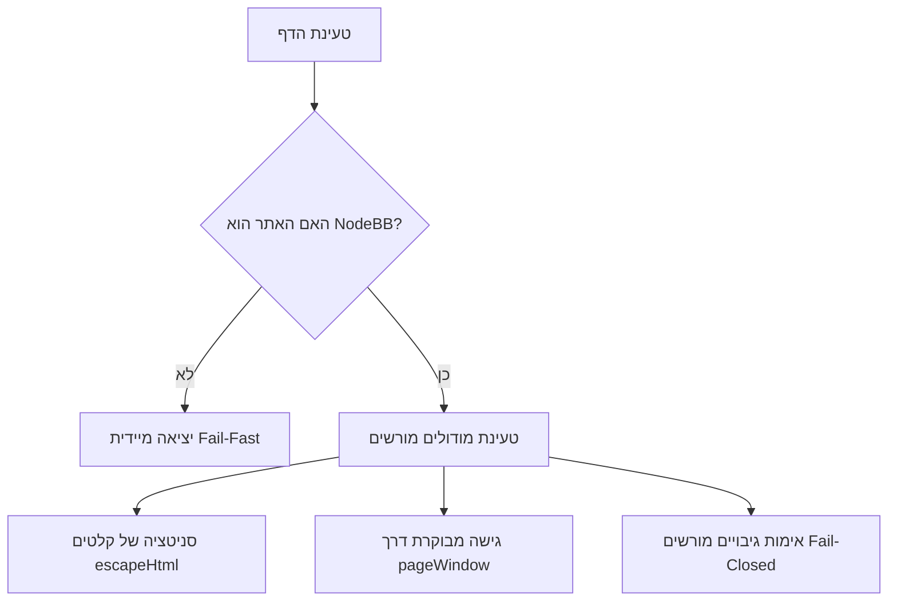

# NodeBB Unified – אוסף הכלים המאוחד לפורומי NodeBB

[](https://github.com/moishyf/NodeBB-Unified/actions/workflows/test.yml)


**NodeBB Unified** הוא אוסף תוספים ומודולים מאוחד עבור פורומים המבוססים על פלטפורמת **NodeBB** (כדוגמת [מתמחים טופ](https://mitmachim.top/)). 
הפרויקט מאחד עשרות סקריפטים בודדים לכדי פתרון יחיד, מודולרי ומאובטח, הכולל פאנל ניהול מרכזי, מנגנון גיבוי ושחזור קלטים, והגנות אבטחה מתקדמות.

---

## תוכן עניינים
- [תכונות ומודולים](#תכונות-ומודולים)
- [פאנל ניהול מרכזי](#פאנל-ניהול-מרכזי)
- [התקנה ודרישות קדם](#התקנה-ודרישות-קדם)
- [ארכיטקטורת אבטחה](#ארכיטקטורת-אבטחה)
- [פיתוח ובדיקות אוטומטיות](#פיתוח-ובדיקות-אוטומטיות)
- [רישיון ותרומה](#רישיון-ותרומה)

---

## תכונות ומודולים

הסקריפט בנוי במבנה מודולרי מבודד. ניתן להפעיל ולכבות כל מודול באופן עצמאי דרך פאנל ההגדרות:

### 🌐 ממשק ותרגום (Localization & UI)
- **תרגום לעברית:** תרגום מקיף של אימוג'ים, מערכת הסקרים והתראות הפורום לעברית תקינה מבלי לפגוע במזהים פנימיים.
- **תאריך עברי:** הצגת תאריך עברי לצד התאריך הלועזי בתצוגת פוסטים ושרשורים.
- **עיצוב צ'אט בסגנון WhatsApp:** שדרוג תצוגת חלון הצ'אט וההודעות למבנה מודרני ונקי.
- **תיקוני תצוגה וגופנים:** תיקון גופנים (כגון שלוש נקודות), תיקון תצוגת משתמשים מסומנים ותיקון טקסט מספרי פוסטים.

### 🛠️ ניהול תוכן וכלים אישיים (Content & Productivity Tools)
- **רשימת קריאה וסימניות:** שמירת פוסטים ושרשורים לרשימת קריאה אישית, סימון נקרא/לא נקרא וניהול הערות לכל פוסט.
- **הערות ותגיות פרטיות על משתמשים:** הוספת תגית צבעונית והערה פרטית על משתמשים בפורום (המידע שמור מקומית בדפדפן בלבד).
- **נושא אקראי:** כפתור שליפת נושא אקראי מכל הזמנים לפי קטגוריות נבחרות.
- **התראות לפי מילות מפתח:** הגדרת מילות מפתח לקבלת התראה אוטומטית בעת איתור נושאים חדשים.
- **סינון תגיות:** סינון והסתרת נושאים לפי תגיות מוגדרות מראש.

### 💬 שדרוגי צ'אט ועיצוב טקסט (Chat & Editor Enhancements)
- **חלון עיצוב הודעות בצ'אט:** סרגל כלים מתקדם להודעות צ'אט הכולל מדגיש (Bold), נטוי (Italic), בלוק קוד, ציטוט, תמונות, קישורים, ספוילרים ויישור טקסט.
- **הודעות קוליות בצ'אט:** אפשרות הקלטה ושליחת הודעות קוליות ישירות בחלון הצ'אט.
- **קישור מהיר לפוסטים:** שליחת קישור מעוצב לפוסט מבוקש בתוך שיחת צ'אט.
- **שליחה/עריכה ב-Enter:** שליחת הודעה בלחיצה על Enter ועריכה מהירה.
- **ניקוי צ'אטים ריקים:** אפשרות ניקוי שיחות צ'אט ריקות בלחיצה אחת.

### 📊 ניטור, סטטיסטיקה ודשבורד (Monitoring & Dashboard)
- **דשבורד מרובה אתרים:** ריכוז עדכונים והתראות מפורומים שונים מבוססי NodeBB במקום אחד.
- **סטטיסטיקת מוניטין ודירוגים:** תצוגת טבלת מוניטין ודירוגי משתמשים בפורום.
- **סטטוס משתמשים מחוברים:** תצוגת אינדיקטורים על משתמשים מחוברים.

---

## פאנל ניהול מרכזי

הסקריפט כולל פאנל ניהול אינטגרטיבי המונגש ישירות מתוך סרגל הצד בפורום או דרך תפריט תוסף הדפדפן:

```text
+-------------------------------------------------------+
|  ⚙️ פאנל הגדרות NodeBB Unified                      |
+-------------------------------------------------------+
|  [✓] תרגום לעברית – אימוג'ים והתראות                  |
|  [✓] רשימת קריאה ופוסטים שמורים                       |
|  [✓] תגיות והערות פרטיות על משתמשים                   |
|  [ ] הודעות קוליות בצ'אט                              |
|  ...                                                  |
+-------------------------------------------------------+
|  [ 📥 ייצוא גיבוי ]   [ 📤 ייבוא גיבוי ]  [ 🔄 איפוס ]  |
+-------------------------------------------------------+
```

### ייצוא וייבוא גיבויים
ניתן לייצא את כל ההגדרות, הרשימות וההערות הפרטיות לקובץ JSON מאובטח ולשזר אותן בכל דפדפן או מכשיר אחר.

---

## התקנה ודרישות קדם

### 1. התקנת מנהל סקריפטים
לפני התקנת הסקריפט, יש לוודא שמורכב בדפדפן אחד ממנהלי הסקריפטים הבאים:
- [Tampermonkey](https://www.tampermonkey.net/) (מומלץ)
- [Violentmonkey](https://violentmonkey.github.io/)

### 2. התקנת הסקריפט
להתקנה ישירה, לחץ על הקישור הבא:
👉 **[התקנת NodeBB Unified](https://raw.githubusercontent.com/moishyf/NodeBB-Unified/main/NodeBB-Unified.user.js)**

מנהל הסקריפטים יזהה את הקובץ ויציע להתקין או לעדכן אותו באופן אוטומטי.

---

## ארכיטקטורת אבטחה

הקוד של **NodeBB Unified** נכתב ועבר סקירת אבטחה מקיפה תוך הקפדה על עקרונות אבטחה קפדניים:



1. **זיהוי מהיר (Fail-Fast Detection):**
   הסקריפט בודק מיד עם טעינת הדף אם האתר הוא פורום NodeBB. במידה ולא, הסקריפט נעצר מיד ללא הרצת טיימרים, האזנות או משאבים.

2. **הגנה מפני הזרקת תוכן (DOM XSS Protection):**
   כל המשתנים הדינמיים המוזרקים ל-DOM עוברים סניטציה קפדנית באמצעות פונקציית `escapeHtml()`. ברירת המחדל להצגת טקסט היא `textContent`.

3. **ריכוז גישה ל-`unsafeWindow`:**
   כל הגישות לאובייקטי ה-Window של האתר מבוצעות דרך פונקציית עזר מרכזית (`pageWindow()`), למניעת זיהום זיכרון או עקיפת הסנדבוקס.

4. **אבטחת ייבוא נתונים (Fail-Closed Import Security):**
   מנגנון הייבוא מאמת תאימות ל-`schemaVersion`, אוכף מגבלת גודל קובץ של 10MB, ודוחה מפתחות שאינם כלולים ברשימה המורשת (Whitelist).

---

## פיתוח ובדיקות אוטומטיות

הפרויקט כולל ערכת בדיקות אוטומטית המורצת בצינור ה-CI של **GitHub Actions** בכל Push ו-Pull Request.

### הרצת בדיקות מקומיות
להרצת הבדיקות בסביבת הפיתוח:

```bash
node test/security.test.js
```

פלט הבדיקות הצפוי:
```text
🧪 Starting NodeBB-Unified Security & Integrity Test Suite...

Test 1: Validating JavaScript Syntax...
  ✅ Pass: Userscript parses cleanly without syntax errors.

Test 2: Testing escapeHtml() Security Sanitization...
  ✅ Pass: escapeHtml correctly sanitizes script tags, attributes, quotes, and special characters.

Test 3: Auditing unsafeWindow Centralization...
  ✅ Pass: All unsafeWindow accesses are properly centralized through pageWindow().

Test 4: Testing Fail-Closed Import Payload Security (validateImportPayload)...
  ✅ Pass: validateImportPayload correctly enforces Fail-Closed security and schema validation.

🎉 ALL SECURITY & INTEGRITY TESTS PASSED SUCCESSFULLY!
```

---

## רישיון ותרומה

- **מברים מקוריים:** מודולים שונים נכתבו על ידי חברי קהילת [מתמחים טופ](https://mitmachim.top/).
- **איחוד ואבטחה:** מתוחזק ומאוחד על ידי [Moishy](https://github.com/moishyf).
- **תרומה לפרויקט:** הצעות לשיפור, דיווחי באגים ו-Pull Requests יתקבלו בברכה דרך [GitHub Issues](https://github.com/moishyf/NodeBB-Unified/issues).
